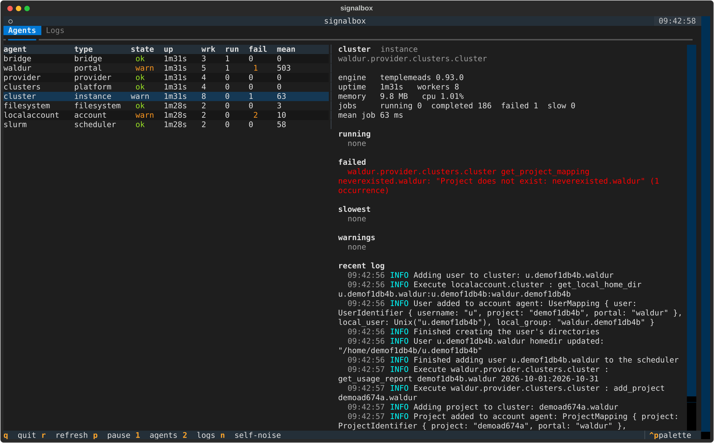
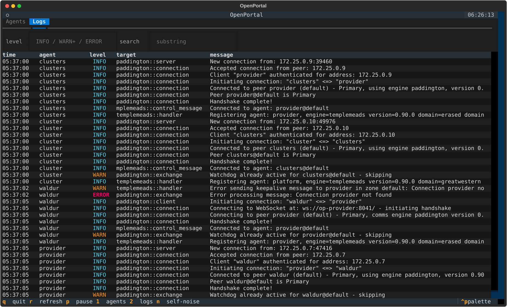
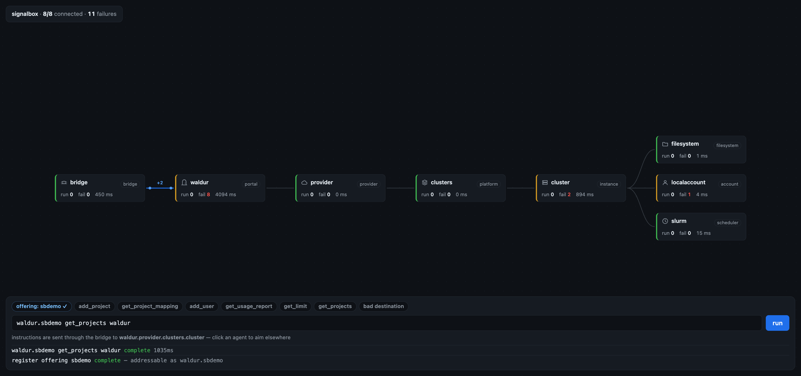
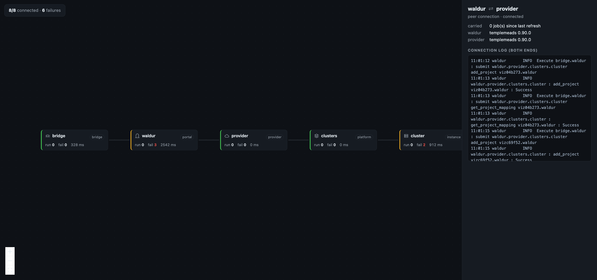
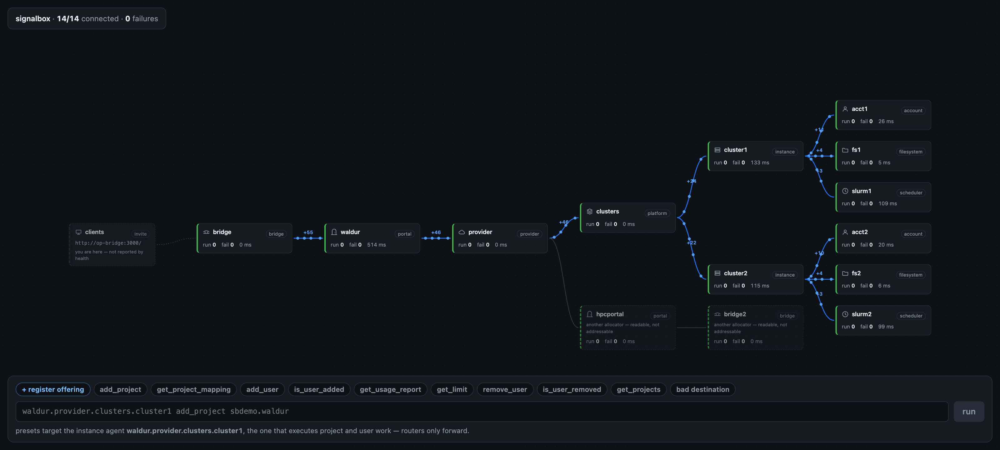

# signalbox

Development tools for watching — and poking at — a running
[OpenPortal](https://github.com/isambard-sc/openportal) agent network. Answers
"which hop is broken, and what did it say?" without reading several containers'
logs side by side.

Named for the railway signal box, which is where you watch and route traffic
across a network. OpenPortal's own crates are Great Western Railway references
(`paddington`, `templemeads`, `greatwestern`), so it keeps the convention.

Two front ends over one shared data layer (`opdata.py`):

| | |
|---|---|
| `./tui.sh` | **Terminal UI** — for actually watching a system |
| `./run.sh` | **Graph view** — the shape of the network, live traffic, per-link history, and a console |

Both find the running bridge by themselves. With a Docker Compose
deployment you need nothing but Docker; agents running natively on the
host are watched too — see [Native deployment](#native-deployment).

```bash
git clone https://github.com/livenson/openportal-signalbox
cd openportal-signalbox
./tui.sh          # or ./run.sh, then open http://localhost:8900
```

No agent network to hand? `./stack.sh up` builds a throwaway eight-agent one —
see [A network to point it at](#a-network-to-point-it-at).

Everything comes from the bridge's signed HTTP API — `health()` for the agent
tree, `diagnostics(destination)` for one agent's jobs, warnings and log — so no
agent needs changing and nothing is installed alongside them.

## Terminal UI



**Agents** (`1`) lists every agent with state, uptime, workers, jobs in flight
and failures. Moving the cursor loads that agent's diagnostics on the right:
its running, failed and slowest jobs, warnings, and the tail of its log.

**Logs** (`2`) is one timeline across every agent, which is the view that is
genuinely awkward otherwise — each agent keeps its own buffer, so following a
single job means reading several containers at once. Filter by level (`INFO`,
`WARN+`, `ERROR`) and by substring.



Keys: `1`/`2` switch view, `r` refresh, `p` pause auto-refresh, `n` show the
tool's own polling chatter, `q` quit.

## Graph view



Built with [React Flow](https://reactflow.dev) laid out by dagre, and — despite
React Flow normally meaning React, JSX and a bundler — with **no build step**:
`htm` replaces JSX with tagged templates and everything loads from esm.sh as
plain ES modules. One HTML file, no npm.

- **Cards, not dots.** Each agent shows the numbers you triage on — jobs
  running, failures, mean job time — so nothing needs a click. An icon per role
  is drawn in the muted colour: the icon carries *identity*, the left border
  carries *status*, and keeping those on separate channels keeps both readable.
- **Traffic flows along the edges.** Dots travel each hop that carried work,
  labelled with the count. There is no per-edge counter in the bridge, so this
  is the rise in an agent's completed count between polls, pushed up its own
  route — work executed on a leaf must have crossed every hop above it, and
  routers never increment a counter of their own.
- **Click an agent** for its jobs, warnings and log; **click a link** for that
  peer connection: both ends' engine versions, what it carried, and the
  connection log reconstructed from *both* endpoints — handshakes, watchdog
  timeouts, reconnects — which otherwise lives in two containers.



- **Filter messages** by level and substring. The filter is applied by the
  agent itself, so narrowing asks for less rather than hiding rows locally.
- **Run instructions** from the console, aimed at whichever agent is selected.

## The console, and learning the protocol

The preset chips walk the instruction grammar in order — `add_project`,
`get_project_mapping`, `add_user`, `get_usage_report`, `get_limit`, plus a
deliberately broken destination so you can watch a routing failure. They share
one demo project, so running them top to bottom is a working tour.

Presets are **role-aware**. Routers (provider, platform) and the bridge forward
instructions rather than executing them, so a preset aimed at one is guaranteed
to fail; each preset knows which agent role can answer it and targets
accordingly. Nothing is hardcoded — the portal names itself through the API.

### "register offering"

`get_projects` is answered by the *portal software* (e.g. Waldur), not by an
agent, and the bridge accepts job submissions only from **virtual** agents — a
same-process stand-in that re-injects the message into the portal's own
handler. Those come from `sync_offerings`, and each becomes addressable as
`<portal>.<offering>`.

So `<portal>.<some-agent>` is not a route and simply errors. The console
registers an offering for you when a preset needs one.

### The console writes

Everything else in signalbox only reads. The console submits jobs, so it can
change the system — it creates real projects and users on real agents. That is
the point of it, but it means this is a tool for development stacks.

```bash
SIGNALBOX_READONLY=1 ./run.sh    # console disabled, viewer unchanged
```

A job still pending when the wait expires is reported as a failure rather than
a success — an instruction aimed at an unroutable agent is never rejected, it
simply never lands, and calling that "ok" would read as a pass.

## A network to point it at

`./stack.sh up` builds a throwaway eight-agent network — the same shape as a
real deployment, with no portal software behind it — and `run.sh` and `tui.sh`
find it exactly as they find anything else.

```bash
./stack.sh up                    # under a minute, cold
./tui.sh                         # or ./run.sh
./stack.sh status                # what the bridge sees
./stack.sh topologies            # what shapes are available
./stack.sh up multi-allocator    # a harder one
./stack.sh down                  # and its volumes
```

**`chain`** (default) — one allocator, one cluster. The shape the front ends
were designed against:

```
op-bridge → waldur (portal) → provider → clusters (platform)
  → cluster (instance) → filesystem + slurm + localaccount
```

**`zoned`** — two estates on one host, separated by zone. Nothing is shared,
and the separation is total: a bridge sees its own zone and the other estate is
**absent from the health report**, not merely unreachable in it. So one
signalbox shows one zone, and a zone-separated host needs one instance per
zone. Point the second one at the other estate with
`OPENPORTAL_BRIDGE_INVITE=/inv/bridge2-invite.toml ./run.sh`.

**`multi-allocator`** — two allocators, each with its own portal and bridge,
both allocating onto two shared clusters through one provider. Their traffic
crosses on every shared hop, and `waldur.provider.clusters.cluster2` and
`hpcportal.provider.clusters.cluster1` are both live routes:

```
op-bridge  → waldur    (portal) ─┐
                                  ├→ provider → clusters ─┬→ cluster1 → fs1/slurm1/acct1
op-bridge2 → hpcportal (portal) ─┘                        └→ cluster2 → fs2/slurm2/acct2
```

The allocators do not talk to each other, and cannot: a Portal holds a key pair
to its Provider and to nothing else, and zones exist so "portal A cannot receive
messages intended for portal B". Point signalbox at the second allocator with
`OPENPORTAL_BRIDGE_INVITE=/inv/bridge2-invite.toml ./run.sh`.

All eight agents come from upstream's release binaries — statically linked,
~8 MB each — dropped into one image. Upstream also publishes per-agent OCI
images, but not for `op-localaccount`, and they are the wrong shape here
anyway: the leaf agents shell out (`op-localaccount` to `useradd`, `op-slurm`
to `sacctmgr`), which a distroless image has nothing to run.

The three leaves share one container, because op-localaccount creates the Unix
group and op-filesystem chowns to it — split apart, every `add_project` fails
on a group the filesystem agent cannot see. They keep separate identities and
ports, so signalbox shows them as the three agents they are.

This is a development stack in the fullest sense: the invite it mints is a
full-control credential, and the console will create real users and groups
inside it. That is what it is for.

## Three things that look broken but are not

**`Dropping notification … after 3 failed signal attempts`** in agent logs. If
the bridge was initialised without `--notification-url` it keeps its default of
`http://localhost/notification`, which nothing serves, so every notification is
retried three times and dropped. Portal software that implements no
notification receiver (Waldur, today) loses nothing by this — and `stack.sh`,
which has no portal software at all, logs it constantly.

**`<portal>.<agent> get_projects <portal>` errors.** See "register offering"
above — that address has to be a registered offering, not an agent name.

**`401 Unauthorized … Date is outside acceptable time window`.** Not the
invite. Every request is signed with a `Date`, and the bridge rejects one more
than **five seconds** from its own clock — so this is clock skew between
wherever signalbox runs and wherever the bridge runs, and under Docker Desktop
it also shows up on its own after the VM's clock jumps. Retrying works; a
container restart fixes it for good. Worth knowing because a 401 otherwise
reads as a bad key.

## Two allocators on one estate

The multi-allocator topology is the shape that used to be drawn wrong, and it
is worth understanding because a national service sold through more than one
allocation route is exactly this picture.

Reaching the second allocator means going *through* the provider both of them
share, so a plain walk hands it `waldur.provider.hpcportal` — a path that reads
as a downstream agent of waldur's. That path is not nothing: diagnostics is
routed hop by hop across the peer graph, so it genuinely reaches hpcportal and
the inspector opens on it. What it is not is a destination. Instructions are
addressed `<portal>.<agent>...` from the portal that *owns* the agent, and
there is no such route from here — a job sent there is never refused, it simply
never lands.

So the two questions are answered separately. Every agent carries:

- **`id`** — how to ask about it through this bridge. Works for the whole
  graph, including the other allocator's half.
- **`route`** — where to send it an instruction, or `null` when there is no
  route from here. The console only ever offers agents that have one.



Above: `./stack.sh up multi-allocator`. Work flows through both clusters —
either allocator can allocate onto either — while `hpcportal` and its `bridge2`
are drawn back, dashed, as another allocator's. Click them and the inspector
still opens; the console will not aim at them.

The health report is what makes this possible: every agent reports its
`agent_type`, and a portal reached below the first hop is by construction
somebody else's, because OpenPortal roots every route at a portal and forbids a
portal from querying another.

## Native deployment

Not every network runs under Compose. When the agents are processes on the
host there is no container to discover, so point the launchers at the bridge
invite instead and they run the tool here rather than in a container:

```bash
OPENPORTAL_BRIDGE_INVITE=/path/to/bridge-invite.toml ./run.sh
```

That is the whole switch — an invite that exists means native mode, no invite
means Docker discovery, exactly as before. The launcher builds a
`.venv-signalbox` beside the scripts and installs the pinned client into it.
If you already have an interpreter with a matching `openportal` (the portal's
own virtualenv, usually), hand it over and nothing is installed:

```bash
SIGNALBOX_PYTHON=/srv/portal/.venv/bin/python ./tui.sh
```

The pin matters here in a way it does not under Docker, where one version
drives both halves of the stack. A native deployment may be running a
different release, and from 0.91.0 the client signs the V2 canonical string
while an older bridge verifies the V1 one — so a mismatch surfaces as an
authentication failure rather than a version error. signalbox compares the two
after connecting and says so:

```text
WARNING rp: client 0.93.0 against a bridge reporting 0.91.0
```

## Several deployments in one graph

A review portal and a site portal are two deployments, two bridges, two
invites — and one picture worth having, since the interesting failures are
between them. List them in a config file:

```toml
# signalbox.toml, beside the scripts (or point SIGNALBOX_CONFIG at it)
[[deployment]]
name = "rp"
invite = "/path/to/rp-invite.toml"
label = "Review portal"

[[deployment]]
name = "efp"
invite = "/path/to/efp-invite.toml"
label = "Site portal"

[[link]]
from = "rp"
to = "efp"
zone = "rp>efp"
```

Every agent is then tagged with the deployment it belongs to, and addressed by
a qualified key — two portals both having an agent called `portal` is the
normal case, not an edge case. Diagnostics, the log timeline and the console
all follow the selected agent's deployment, so an instruction is never written
against agents its bridge cannot reach. A deployment that is down is reported
next to the summary; the other one still draws.

`SIGNALBOX_INVITES="rp=/a.toml,efp=/b.toml"` does the same without a file, for
a shell that has no TOML parser to hand.

**The bridge's other end.** `op-bridge` does not join two sites — it joins the
agent protocol to everything outside it. Its openportal end peers with its own
portal and is reported by `health()`; its other end is a signed HTTP endpoint
that Waldur and this tool call in on, and nothing on the wire mentions it
(`HealthInfo` carries no addresses for any agent). So it is drawn from the
invite you already hold, dashed and labelled *you are here*, as the one node
that is not part of the reported estate. The Waldur side of it — the bridge's
`signal_url` — stays invisible; it lives only in the bridge's own config.

**Why the link is configured rather than discovered.** It is not an omission:
OpenPortal refuses portal-to-portal health and diagnostics *on purpose*. The
responder ignores a health check whose sender is a portal — `handler.rs`,
"prevent information leakage between sites" — and the requester strips portal
peers out of the cascade before asking (`health.rs::collect_health_inner`). So
neither portal will ever report the other, no matter which bridge you ask. An
operator holding both invites already knows the link exists; `[[link]]` is
where they say so, and it is drawn dashed and unlabelled by traffic to keep
the distinction visible.

## Limitations

- **Logs are recent-only.** Each agent keeps an in-memory ring buffer that dies
  with the process, so this is a live-debugging tool, not post-mortem.
- **Everything routes through the bridge.** If the bridge is down you get an
  error and nothing else — the one case where you must fall back to
  `docker logs` and the per-agent healthcheck ports.
- **The invite is a credential.** Holding it means full control of the agent
  network, not read-only access, whatever these tools choose to call. Keep it
  to development stacks.
- **Polling, not streaming.** Five-second refresh; the bridge does not push.
- **One bridge at a time, in sequence.** The client keeps its configuration in
  a process-global, so several deployments are polled one after another behind
  a lock rather than in parallel. Fine for a handful; not a fleet view.
- Traffic counts are per refresh interval, not a per-job trace. A job that
  starts and finishes between two polls is counted, but never seen moving.
- The graph view loads React Flow and dagre from a CDN, so it needs network
  access on first load. The TUI has no such dependency.

## Development

```bash
pip install pytest && python -m pytest      # 68 tests, ~5s, no network
ruff check . && ruff format --check .

./stack.sh up && ./live.sh                  # 22 more, against real agents
```

The offline suite fakes the compiled `openportal` module rather than installing
it — the real one is useless without a live agent network. The fake
deliberately keeps the bindings' quirks, most notably that `HealthInfo` exposes
`peers` as a method while its neighbours are properties; smoothing that over
would test the wrong thing.

Those tests are weighted towards what actually broke while building this: the
property-vs-method inconsistency, peer links that turn a tree walk into a loop,
filtering that ate its own limit, a job reported as successful when it had not
finished, and a cache keyed without its filters. `tests/test_stack.py` adds the
contract between the stack and the launchers — the compose service and volume
names discovery matches on, and the version pin, which has to be one release
across client and agents because a mismatch fails as an authentication error
rather than a version warning.

`tests/test_live.py` closes the gap the fake cannot: it asserts the same
documented constraints against agents that actually exist — that `peers` really
is a method, that a router really does refuse to execute, that polling really
does log itself, that an unroutable destination really does come back
unfinished rather than rejected. A fake is only ever as correct as our reading
of the bindings, and this is what checks the reading. Run it with `./live.sh`,
which puts pytest inside the agent network the same way `run.sh` puts the proxy
there; on its own, `python -m pytest` deselects it.

CI runs the offline suite on every push, and the live one nightly and on
demand — the agents are pinned to a commit, but the client comes from PyPI and
the base images move under both.

## Status

A working prototype, developed against OpenPortal 0.91.0 and a Waldur portal.

**Not covered by tests:** the viewer's browser behaviour beyond parsing, and
anything needing portal software behind the portal agent — `stack.sh` has none,
so the incoming direction is exercised only as far as registering an offering.
Issues and patches welcome.

## Licence

MIT — see [LICENSE](LICENSE).
