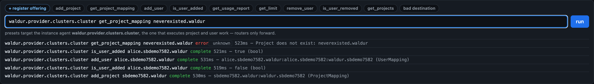

# The console, and learning the protocol

The graph view's console submits OpenPortal instructions through the bridge and
shows what came back. It is also the quickest way to learn the instruction
grammar against agents that really answer.

## The presets

The preset chips walk the instruction grammar in order — `add_project`,
`get_project_mapping`, `add_user`, `is_user_added`, `get_usage_report`,
`get_limit`, `remove_user`, `is_user_removed`, plus a deliberately broken
destination so you can watch a routing failure. They share one demo project,
so running them top to bottom is a working tour.

`is_user_added` and `is_user_removed` ask the account, filesystem and scheduler
agents together, so they are how you find out whether an add or a remove really
ran everywhere rather than just being acknowledged. Against the
[test stack](test-stack.md) `is_user_removed` fails after a removal: it asks
`sacct --state=…` for running jobs, and the Slurm emulator does not accept that
flag.

Presets are **role-aware**. Routers (provider, platform) and the bridge forward
instructions rather than executing them, so a preset aimed at one is guaranteed
to fail; each preset knows which agent role can answer it and targets
accordingly. Nothing is hardcoded — the portal names itself through the API.

## Reading the answers

A failure shows the agent's own message and its **kind** (hover for the
exception class). `award_pending` is drawn amber rather than red: an award
waiting on a person is to be retried, not fixed.



Newest first: `add_project`, then `is_user_added` before and after `add_user`
(`false`, then `true`, typed `bool`), then a mapping for a project that does
not exist, refused with the agent's own words.

A job still pending when the wait expires is reported as a failure rather than
a success — an instruction aimed at an unroutable agent is never rejected, it
simply never lands, and calling that "ok" would read as a pass.

## "register offering"

`get_projects` is answered by the *portal software* (e.g. Waldur), not by an
agent, and the bridge accepts job submissions only from **virtual** agents — a
same-process stand-in that re-injects the message into the portal's own
handler. Those come from `sync_offerings`, and each becomes addressable as
`<portal>.<offering>`.

So `<portal>.<some-agent>` is not a route and simply errors. The console
registers an offering for you when a preset needs one.

## The console writes

Everything else in signalbox only reads. The console submits jobs, so it can
change the system — it creates real projects and users on real agents. That is
the point of it, but it means this is a tool for development stacks.

```bash
SIGNALBOX_READONLY=1 ./run.sh    # console disabled, viewer unchanged
```
